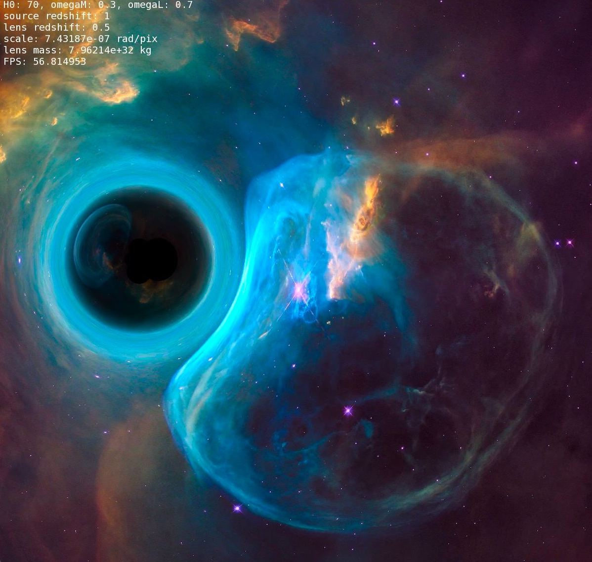
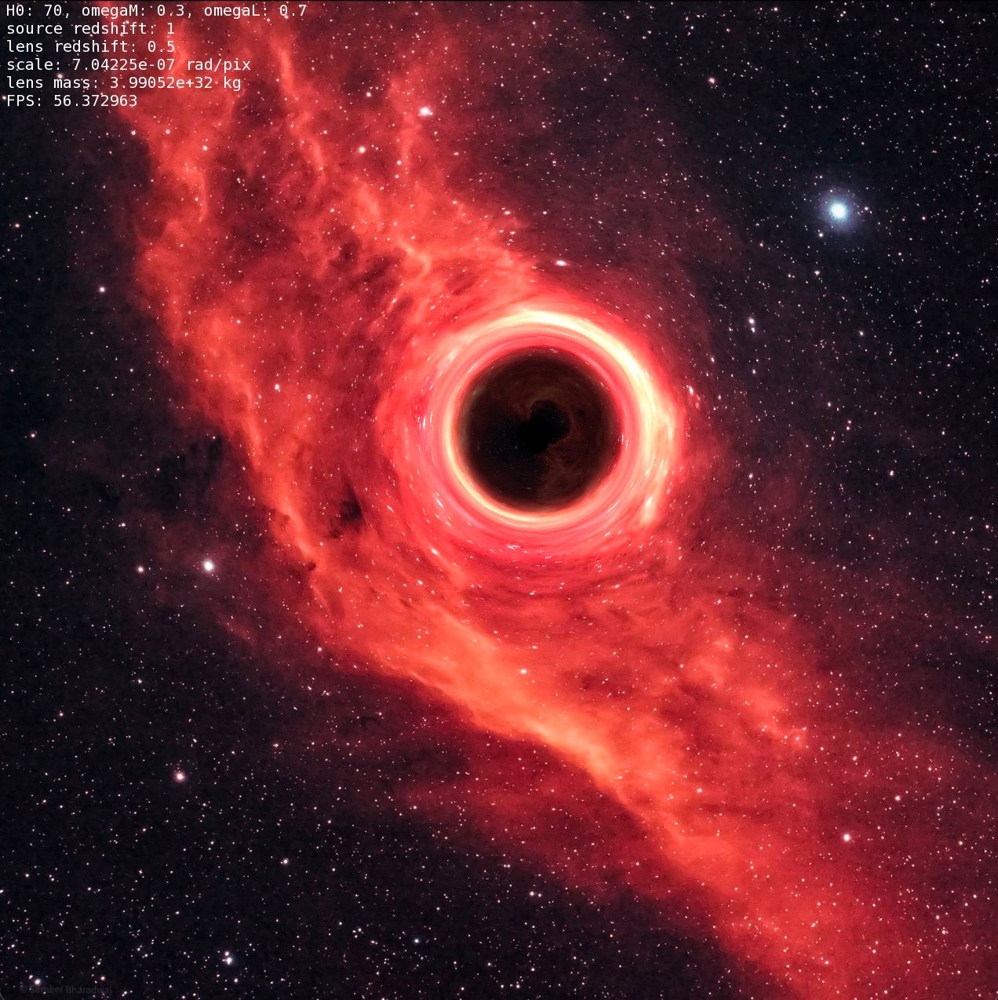
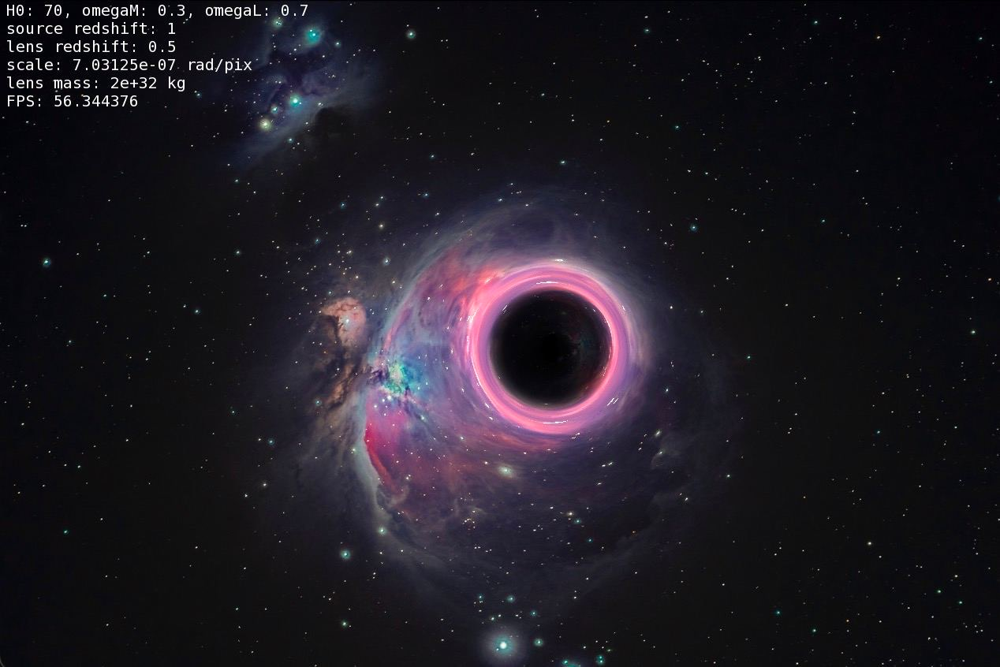
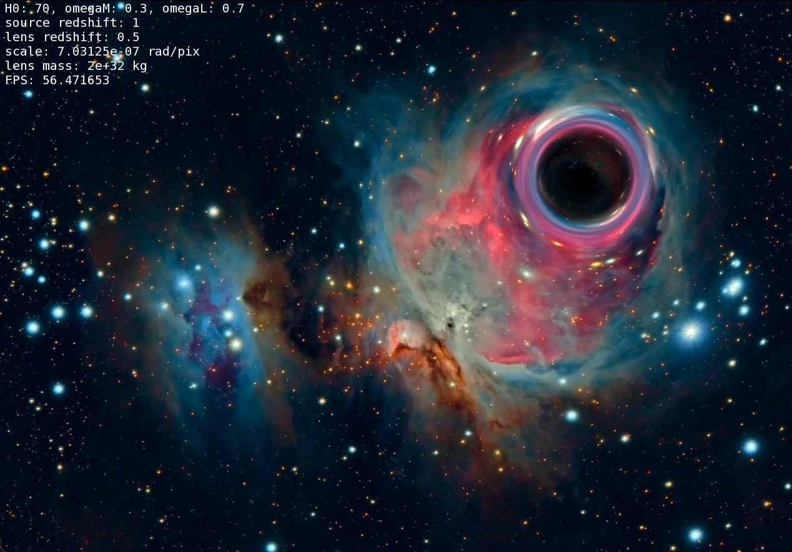

# Strong gravitational lensing model

It is a model of strong gravitational lensing in the point source and point lens approximation. 
Each point is considered as a separate source refracted by massive object. For renderin is using SFML graphic library.

### Required
- C++ compiler (C++17 standart was used)
- [SFML](https://www.sfml-dev.org/) 
- [gsl](https://www.gnu.org/software/gsl/doc/html/index.html) ([gsl_integration.h](https://www.gnu.org/software/gsl/doc/html/integration.html))

There are some examples of result model

And some tips about using. To compile and run code execute `complile.sh` file in this directory or use following expression 
    
    g++ -std=c++17 main.cpp -I/opt/local/include/ /opt/local/lib/libsfml-graphics.dylib /opt/local/lib/libsfml-audio.dylib  /opt/local/lib/libsfml-window.dylib /opt/local/lib/libsfml-system.dylib -Ofast -lgsl -lcblas -o main

    ./main

### Control

| Command |              Action            |
|---------|--------------------------------|
|LMB Click|  Set the lens position         |
|LMB Drag | Lens is following the mouse    |
|Arrows   | Move the lens in this direction|
|Plus     | Increase the lens mass         |
|Backspace| Decrease the lens mass         |
|Enter    | Switch magnification show mode |